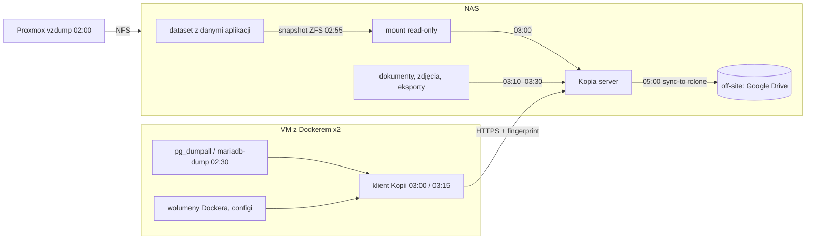

# Backup, który sam mówi, czy działa

Przez rok mój homelab nie miał żadnego backupu. Dwie maszyny wirtualne z Dockerem, kilkadziesiąt kontenerów, NAS z ZFS-em — i zero kopii poza samą redundancją dysków. Wiedziałem, że to źle. Wiedziałem też, dlaczego nic z tym nie robię: nie bałem się braku backupu. Bałem się backupu, który **wygląda**, jakby działał.

W pracy zajmuję się Data Governance i jakością danych. Tam podstawową zasadą jest: *jeśli nie mierzysz, to nie wiesz*. Ten artykuł to case study przeniesienia tej zasady na własny sprzęt — od pierwszego snapshotu Kopii po workflow w n8n, który co rano ocenia 14 źródeł backupu i mówi, które z nich są nieaktualne, niekompletne lub uszkodzone.

---

## Problem: 3-2-1 to polityka, nie kontrola

Reguła 3-2-1 (trzy kopie, dwa nośniki, jedna poza domem) jest wszędzie. Ale to **polityka** — mówi, jak ma być. Nie mówi, jak sprawdzić, czy jest.

W praktyce backupy w domu psują się cicho:

- cron działa, ale snapshot ma 0 plików, bo katalog źródłowy odmontował się po restarcie,
- klient backupu nie łączy się z serwerem od tygodnia, a jedyny log leży na maszynie, na którą nikt nie patrzy,
- baza w kontenerze jest kopiowana „na gorąco" i pliki są niespójne,
- off-site synchronizuje się, ale z błędem `rc=1` na końcu, którego nikt nie czyta.

Każdy z tych przypadków spełnia 3-2-1 na papierze. Potrzebowałem więc dwóch rzeczy: sensownej architektury backupu **i** niezależnej warstwy, która codziennie zweryfikuje, czy ta architektura robi to, co obiecuje.

---

## Architektura: Kopia na NAS-ie

Wybrałem [Kopię](https://kopia.io/) — open-source, deduplikacja, kompresja zstd, szyfrowanie po stronie klienta, tryb serwera z użytkownikami i API. Serwer stoi jako kontener na NAS-ie (TrueNAS), repozytorium leży na puli ZFS.

Cztery warstwy, każda z innym celem:

| Warstwa | Co chroni | Narzędzie | Kiedy |
|---|---|---|---|
| Snapshot ZFS + Kopia | dane aplikacji na NAS-ie (spójny obraz) | `zfs snapshot` → Kopia | 02:55 → 03:00 |
| Klienci Kopii na VM | wolumeny Dockera, configi, zrzuty baz | Kopia CLI, cron | 02:30 → 03:00/03:15 |
| Off-site | całe repozytorium Kopii | `kopia repository sync-to rclone` | 05:00 |
| vzdump | pełne VM (odtworzenie po padzie dysku) | Proxmox → NFS na NAS | 02:00 |

Retencja jako polityka Kopii: 7 dziennych, 4 tygodniowe, 6 miesięcznych; zdjęcia (250 GB) skromniej — 3/2/3 i bez kompresji, bo JPEG-ów i tak nie ściśniesz.

### Spójność: snapshot ZFS zamiast „kopiuj na żywo"

Kontenery na NAS-ie piszą do plików cały czas. Kopiowanie takiego katalogu daje obraz, w którym połowa plików jest z 03:00, a druga z 03:04. Rozwiązanie: cron o 02:55 robi snapshot ZFS datasetu i montuje go read-only w stałym miejscu; Kopia o 03:00 czyta już tylko zamrożony obraz.

Dwie pułapki, których nie znajdziesz w dokumentacji:

1. **`.zfs/snapshot` nie działa z wnętrza kontenera** — automount ZFS nie przechodzi przez mount namespace Dockera i kończy się błędem `Too many levels of symbolic links`. Stąd jawny `mount -t zfs -o ro` na hoście.
2. **Bind mount do kontenera musi wskazywać katalog nadrzędny**, nie sam punkt montowania snapshotu. Inaczej kontener trzyma referencję do starego montu i `zfs destroy` zwraca `dataset is busy`. Do tego `rslave`, żeby kontener widział podmianę montu bez restartu.

### Bazy danych: zrzut jest źródłem prawdy

Wolumeny Dockera na VM leżą na ext4 — nie ma snapshotów. Katalog `pg_data` skopiowany w trakcie zapisu jest bezwartościowy. Dlatego przed backupem chodzi generyczny skrypt: iteruje po kontenerach, znajduje te z montem `/var/lib/postgresql/data` lub `/var/lib/mysql`, robi `pg_dumpall` / `mariadb-dump --all-databases`, pakuje zstd do jednego katalogu. Szesnaście baz na dwóch VM, poniżej minuty łącznie.

To jest decyzja architektoniczna, nie techniczna: **backup katalogu bazy to artefakt pomocniczy, zrzut logiczny to źródło prawdy**. Zapisałem to wprost w notatkach, żeby za pół roku nie kusiło mnie „przecież katalog też jest w Kopii".

### Off-site bez płacenia za drugi NAS

Kopia ma wbudowane `repository sync-to`, a obraz kontenera zawiera rclone. Jeden skrypt, jeden cron o 05:00, cel: Google Drive z pakietu, który i tak miałem. 70 GB repozytorium (po deduplikacji i kompresji) synchronizuje się przyrostowo w kilka minut; pierwszy pełny sync zdjęć zajął noc. Jedyny warunek, którego przestrzegam: po pierwszym syncu **podłączyłem się do kopii off-site z innego komputera i odpaliłem `kopia snapshot verify`**. Kopia sama ostrzega, że backend rclone jest „not actively tested" — więc testuję ja.

---

## Strażnik: data observability dla backupów

Tu zaczyna się część, dla której powstał ten wpis. Architektura powyżej ma pięć cronów na trzech maszynach i cztery różne logi. Nikt tego nie będzie czytał codziennie. Potrzebowałem jednego punktu, który o 04:00 zada każdemu źródłu backupu to samo pytanie: **czy jesteś świeży, kompletny i bez błędów?**

Zbudowałem to w [n8n](https://n8n.io/), które i tak stoi w homelabie. Workflow „Strażnik backupów":

1. **Pobiera stan z API Kopii** (`GET /api/v1/sources`) — jeden request daje wszystkie źródła ze wszystkich hostów: ostatni snapshot, rozmiar, liczbę plików, liczbę błędów.
2. **Ocenia każde źródło progami zdefiniowanymi per źródło**, nie globalnie. Dane aplikacji: wiek ≤ 26 h, rozmiar ≥ 1 GB, pliki ≥ 5000, błędy = 0. Zdjęcia: ≥ 200 GB, ≥ 10 k plików. Backup komputera, który robi się raz w tygodniu: wiek ≤ 192 h.
3. **Sprawdza to, czego nie ma w Kopii**: backupy VM przez API Proxmoxa (ostatni plik ≤ 30 h, ≥ 1 GB), replikację ZFS i alerty TrueNAS przez webhooki push z NAS-a, wynik off-site z kodu wyjścia skryptu.
4. **Brak źródła na liście = alarm krytyczny.** To najważniejsza reguła. Backup, który przestał istnieć, nie zgłosi się sam.
5. **Wysyła wynik do jednego dyspozytora powiadomień** (osobny workflow n8n), który normalizuje severity, deduplikuje po kluczu (`kopia:<host>:<ścieżka>`) i kieruje: krytyczne na Discord `#alerts` + push na telefon, informacyjne na `#backups`.

Efekt: rano widzę czternaście zielonych linijek albo jedną czerwoną z konkretem. Nic pomiędzy.

### Pułapki, które Strażnik wyłapał w pierwszym tygodniu

- **Strefa czasowa NAS-a była ustawiona na US Pacific.** Crony NAS-a (snapshot ZFS 02:55, sync 05:00) chodziły 9 godzin później niż crony w kontenerach. Kopia przez kilka dni kopiowała snapshot sprzed 15 godzin. Backup „działał" — po prostu był stary. Wyszło dopiero, gdy porównałem znaczniki czasu w progu świeżości.
- **`stats.fileCount` w API Kopii zwraca 0**, gdy snapshot korzysta z cache'a. Pierwszej nocy Strażnik krzyknął, że backup ma zero plików. Liczba w `summary.files` była poprawna. Próg musi patrzeć na właściwe pole — lekcja znana każdemu, kto pisał reguły DQ na źle udokumentowanym schemacie.
- **Token API Proxmoxa z rolą „tylko audyt" zwracał pustą listę backupów**, nie błąd. Strażnik raportował „brak backupu VM", mimo że pliki leżały na NAS-ie. Proxmox ukrywa backupy bez uprawnień `VM.Backup` na konkretnej VM. Fałszywy alarm krytyczny jest gorszy niż brak alarmu — po tygodniu przestajesz czytać.
- **Nowe źródła z klientów pojawiają się w API serwera dopiero po restarcie kontenera.** Trzy dni Strażnik nie widział połowy backupów, bo lista była zbuforowana.

### Test odtworzenia, bo inaczej to nie backup

Zanim uznałem system za wdrożony: `qmrestore` całej VM z NFS-a do nowego ID (128 GB, 37 minut), start, sprawdzenie konfiguracji, `qm destroy`. Osobno odtworzenie pojedynczego katalogu z Kopii do `/tmp` i porównanie sum. Oba w notatkach z datą — bo za rok będę chciał wiedzieć, kiedy ostatnio to sprawdzałem.

---

## Co z tego dla Data Governance

Nie pisałem tego jako ćwiczenia z governance. Ale kiedy spojrzałem na gotowy system, zobaczyłem w nim jeden do jednego rzeczy, które robię zawodowo.

**Progi Strażnika to wymiary jakości danych.** Wiek snapshotu = *timeliness*. Minimalny rozmiar i liczba plików = *completeness*. Zero błędów w snapshocie = *validity*. Zgodność liczby źródeł z listą oczekiwanych = *consistency* między „co powinno być" a „co jest". Pisałem [o sześciu wymiarach DQ](/blog/2026/data-quality-dimensions/) pół roku temu; tu są te same wymiary zastosowane do metadanych backupu.

**Polityka bez kontroli to dokument.** Retencja 7/4/6 w Kopii to polityka. Strażnik to kontrola. W firmie nazwałbym to *data quality rule* podpiętą pod *data policy* — i dokładnie tak samo jak w firmie, bez kontroli polityka rozjeżdża się cicho (patrz: strefa czasowa).

**Progi per źródło, nie globalne.** Reguła „backup musi mieć ≥ 1 GB" jest bez sensu dla eksportu dokumentów (400 MB) i dla zdjęć (250 GB). W DQ to banał: progi kompletności ustala właściciel danych, nie zespół platformy. W homelabie właścicielem jestem ja, ale zasada jest ta sama — próg wynika ze znajomości danych.

**Brak danych to najgroźniejszy stan danych.** Najważniejsza reguła Strażnika — „źródła nie ma na liście = crit" — to odpowiednik kontroli *„tabela nie została załadowana"*, którą wiele zespołów pomija, bo sprawdzają jakość tylko tego, co przyszło.

**Fałszywe alarmy zabijają kontrolę.** Trzy z czterech pułapek powyżej to fałszywe pozytywy. Każdy z nich obniżał zaufanie do całego systemu. W governance mówi się o *alert fatigue*; w domu nazywa się to „wyciszyłem kanał na Discordzie".

**Źródło prawdy trzeba nazwać.** Zrzut logiczny bazy, nie katalog z plikami. Zapisane wprost. To jest *system of record* w skali jednego człowieka.

Nie twierdzę, że homelab uczy governance lepiej niż praca. Twierdzę, że **te same zasady działają w obu skalach** — a w domu widzisz konsekwencje ich łamania w tydzień, nie w kwartał.

---

## Co dalej

- Codzienny raport 14 zielonych linijek zamienić na zbiorczy poranny briefing; alarmy zostają natychmiastowe.
- Automatyczny test odtworzenia losowego pliku z off-site raz w miesiącu — zamiast polegać na tym, że przypomnę sobie za rok.
- Backup komputera domowego chodzi raz w tygodniu z progiem 192 h. To za rzadko dla dokumentów; do zmiany.

Jeśli masz w homelabie backup, którego nie sprawdza nic poza Tobą — zacznij od jednego pytania zadawanego codziennie automatycznie: *ile godzin ma ostatni snapshot?* Reszta progów dojdzie sama.
