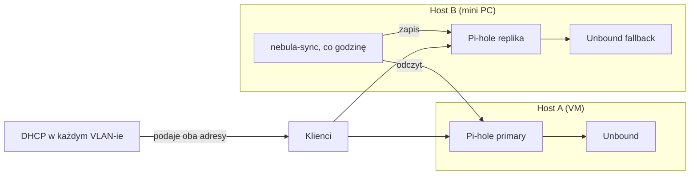

## DNS z zapasem

Kiedy DNS w domu przestaje działać, nikt nie mówi „padł resolver". Mówi się: „internet nie działa". Telewizor nie wchodzi do aplikacji, telefon łączy się z Wi-Fi, ale nic się nie ładuje, a w homelabie kontenery jeden po drugim tracą połączenia z bazami i API.

Mój DNS miał jeden punkt awarii: pojedynczy Pi-hole na maszynie wirtualnej, którą regularnie restartuję i odtwarzam przy aktualizacjach. Ten wpis opisuje, jak dołożyłem drugi, jak sprawdziłem, że przejmuje ruch, i trzy pułapki, które wyszły dopiero podczas testu. Jak poprzednio, na końcu zestawiam wnioski z tym, czym zajmuję się zawodowo, czyli z Data Governance.

---

## Problem: „mam dwa serwery DNS" to nie redundancja

Sam pomysł jest prosty: DHCP podaje klientom dwa adresy DNS. Ale drugi serwer musi robić **to samo** co pierwszy. Gdyby był gołym resolverem bez blokowania reklam, klienci pytaliby oba serwery naprzemiennie i co drugie zapytanie o domenę reklamową dostałoby prawdziwą odpowiedź. Blokowanie działałoby „w połowie".

Potrzebowałem więc repliki, a nie zapasowego resolvera. To zmieniło pytanie z „jak postawić drugi DNS" na „jak utrzymać dwa serwery w zgodzie".

---

## Architektura

- **Dwa Pi-hole na dwóch różnych maszynach.** Drugi na innym hoście fizycznym niż pierwszy: replika na tej samej VM nie chroni przed restartem VM.
- **Własny Unbound przy każdym Pi-hole**, żeby replika nie zależała od zewnętrznych resolverów pierwszej.
- **`nebula-sync` co godzinę** kopiuje konfigurację z primary do repliki. Synchronizacja jest **selektywna**: przenosi listy blokowania, grupy, klientów i rekordy lokalne, ale nie ustawienia specyficzne dla hosta (upstreamy, limity zapytań).
- **DHCP podaje oba adresy we wszystkich VLAN-ach**, także w sieciach gości i IoT. Tam dodatkowo reguły zapory kierują ruch DNS wyłącznie do tych dwóch serwerów.

Dwie decyzje projektowe, które zapisałem w notatkach, żeby nie kusiło mnie ich cofnąć:

1. **Zmiany robię tylko na primary.** Replika jest nadpisywana co godzinę, więc rekord dodany bezpośrednio na niej zniknie. To reguła „jedno miejsce edycji".
2. **Gravity (pobieranie list blokowania) zostaje niezależne.** Replika sama odświeża listy własnym tygodniowym zadaniem. Po zmianie list na primary odświeżam replikę ręcznie. Zsynchronizowanie samej konfiguracji list nie oznacza, że replika je pobrała.

Po wdrożeniu porównałem oba serwery: te same 26 list, około 762 tysięcy domen, identyczne odpowiedzi na próbnych zapytaniach.

---

## Test awarii, bo inaczej to nie redundancja

Zatrzymałem kontener primary na 35 sekund i mierzyłem z komputera:

| Moment | Czas odpowiedzi |
|---|---|
| Pierwsze zapytanie po zatrzymaniu | około 1,4 s (klient czeka na timeout primary) |
| Kolejne zapytania | około 0,27 s (klient trzyma się repliki) |
| Domena reklamowa | zablokowana, tak jak przy primary |
| Kontenery na drugim hoście | dalej łączą się z usługami, odpowiedzi HTTP 200 |

Efekt widoczny dla użytkownika to jedno zauważalne opóźnienie na początku, a potem nic. To dokładnie to, o co mi chodziło.

---

## Trzy pułapki, które wyszły dopiero przy teście

### 1. Pi-hole v6 bez hasła nadaje sobie losowe hasło przy każdym starcie

Test awarii polegał na zatrzymaniu i uruchomieniu kontenera primary. Przy starcie Pi-hole v6 nie znalazł hasła w zmiennych ani w konfiguracji i **wygenerował losowe**. Synchronizacja z repliką zaczęła dostawać `401`.

Gorsze było to, co stało się potem: proces synchronizacji kończył się błędem, a polityka `restart: unless-stopped` zamieniała każdy błąd w kolejny start. Dostawałem alert przy każdym z nich.

Poprawka: ustawiłem hasło na primary poleceniem `pihole setpassword`, identyczne z tym, którego używa synchronizacja (sekret trzymam zaszyfrowany w repozytorium). Hash trafia do konfiguracji i przetrwa restart. Drugą poprawką było przekazywanie hasła do `nebula-sync` z zaszyfrowanego pliku środowiskowego, nie z ręcznie wpisanej zmiennej.

**Wniosek:** test „co się dzieje po zatrzymaniu i starcie" wyłapał błąd, którego nie pokazałby test „czy kontener działa". Redundancja sprawdzona tylko w stanie ustalonym to nie redundancja.

### 2. Reverse DNS to osobna, cicha ścieżka

Podczas testu zauważyłem, że zapytania PTR (adres → nazwa) dla niektórych adresów kończyły się **timeoutem**, a nie odpowiedzią „nie istnieje". Pi-hole przekazywał je do routera, który na tym VLAN-ie w ogóle nie odpowiadał na port 53. Klient czekał około dwóch sekund na każde takie zapytanie.

Poprawka: wyłączyłem przekazywanie zapytań odwrotnych do routera i wpisałem dziesięć stałych hostów jako rekordy lokalne. Zapytania PTR dla znanych adresów odpowiadają teraz w około 20 ms, dla nieznanych dostaję szybkie `NXDOMAIN`. Zmiany zrobiłem na primary, a replika zsynchronizowała się przy najbliższym przebiegu.

**Wniosek:** zdrowy stan DNS mierzy się czasem odpowiedzi, nie samym faktem odpowiedzi. Timeout to gorszy wynik niż „brak takiej nazwy", bo uczy klientów czekać.

### 3. Literówka w rekordzie, którą synchronizacja wiernie rozmnożyła

Przy przeglądzie rekordów znalazłem CNAME wskazujący na nazwę z literówką (brakująca litera). Po stronie primary nikt tego nie zauważał, bo panel Pi-hole sam się nią nie posługiwał. Replika dostała ten sam błąd, bo synchronizacja kopiuje wszystko jak leci.

**Wniosek:** synchronizacja jednokierunkowa replikuje także błędy. Gwarantuje, że oba serwery są **takie same**, nie że są **poprawne**.

---

## Co z tego dla Data Governance

Nie planowałem tego wpisu jako ćwiczenia z zarządzania danymi. Ale replika DNS z jednokierunkową synchronizacją to w małej skali dokładnie ten problem, który spotykam w pracy.

**Jedno źródło prawdy i wyznaczone miejsce edycji.** Reguła „zmiany tylko na primary" to odpowiednik *system of record*. Bez niej dwa systemy zaczynają się rozjeżdżać, a nikt nie wie, który jest właściwy. W firmach ta zasada często istnieje w slajdach, a nie w konfiguracji. Tu wymusza ją sama synchronizacja: ręczna zmiana na replice zniknie w ciągu godziny.

**Selektywna replikacja to decyzja o zakresie.** Nie synchronizuję ustawień specyficznych dla hosta. W governance nazwalibyśmy to określeniem, które atrybuty są *master data*, a które lokalne. Zsynchronizowanie wszystkiego wygląda na bezpieczniejsze, ale przeniosłoby konfigurację jednego hosta na drugi.

**Zgodność nie równa się poprawność.** Literówka w CNAME pokazuje, że kontrola *consistency* (oba serwery mają to samo) nie zastąpi kontroli *validity* (rekord wskazuje na coś, co istnieje). To ta sama różnica, którą widać w [wymiarach jakości danych](/blog/2026/data-quality-dimensions/).

**Test odtworzenia jest częścią kontroli.** Przy [backupach](/blog/2026/kopia-straznik-backupow/) pisałem, że kopia bez odtworzenia to nie backup. Tu jest to samo: replika, którą sprawdzam tylko wtedy, gdy wszystko działa, jest niesprawdzona. Test awarii ujawnił problem z hasłem, którego nie pokazałby żaden monitoring stanu ustalonego.

**Alert, który odpala się w pętli, przestaje być alertem.** Awaria synchronizacji dawała powiadomienie przy każdym restarcie procesu. Ustawiłem klucz deduplikacji, żeby powtarzające się zdarzenie było jednym alertem. Pozostawiłem `restart: unless-stopped`, bo wariant `on-failure` nie wstaje po czystym restarcie hosta, a to gorszy błąd niż nadmiar powiadomień.

Nie twierdzę, że homelab uczy governance lepiej niż praca. Twierdzę, że te same mechanizmy, czyli jedno źródło prawdy, zakres replikacji, rozróżnienie zgodności i poprawności oraz testowanie awarii, działają w obu skalach. W domu widzę skutki ich braku po jednym restarcie, a nie po kwartale.

---

## Co dalej

- Sprawdzić zachowanie klientów w sieciach gości i IoT przy pierwszym urządzeniu, które faktycznie korzysta z DNS w tych VLAN-ach.
- Dodać do porannego raportu prostą kontrolę: czy oba serwery odpowiadają i czy liczba domen na liście zgadza się na obu.
- Zastanowić się nad regularnym, automatycznym testem przełączenia zamiast jednorazowego ręcznego.

Jeśli masz w domu jeden DNS, zacznij od jednego pytania: *co się stanie, kiedy go zrestartuję w środku wieczoru?* Odpowiedź zwykle motywuje szybciej niż każdy artykuł.
